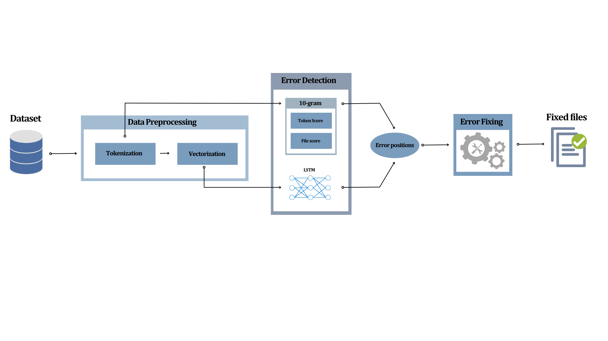
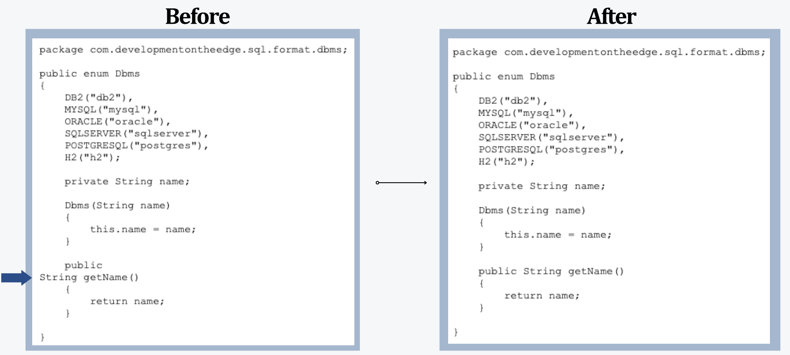
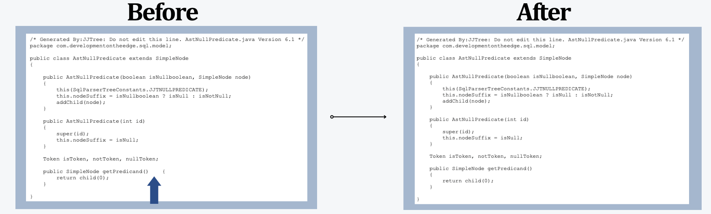
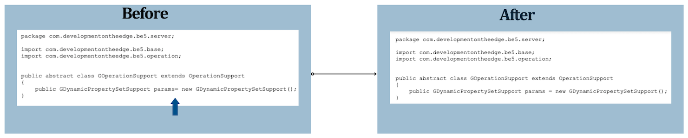

# Thesis
## 📚 Table of Contents 

- [Abstract](#bookmark-abstract)
- [System's Architecture](#hammer_and_wrench-systems-architecture)
- [Usage](#usage)
- [Prerequisities](#white_check_mark-prerequisities)
- [Directory Structure](#file_folder-directory-structure)
- [Technology Stack](#rocket-technology-stack)
- [License](#warning-license)
- [Contact](#handshake-contact)

## :bookmark: Abstract 
<b>Towards an automated source code formatting system</b>
<p align=justify>
Nowadays, the concept of software has prevailed in all aspects of human daily life, offering significant solutions to a wide variety of issues. The need for producing reliable and functional software within short timeframes that can adapt to possible changes is constantly increasing. In recent years, there has been significant research activity in the field of software development process optimization, while the vast availability of open-source software projects in repositories such as GitHub makes accessing large volumes of code data easy. Leveraging this information can serve as a catalyst for creating useful tools that can greatly accelerate the software development process while improving communication and collaboration among development teams. <br>
</p>
<p align=justify>
This thesis presents an integrated system for automated source code formatting using machine learning techniques. The primary goal of the system is to detect and correct formatting errors that deviate from the standards set by the development team, ensuring its readability and thus facilitating easier maintenance. The system utilizes LSTM deep neural network models in combination with N-gram statistical language models for detecting formatting errors, while a specific mechanism for correcting these errors is proposed. Additionally, an evaluation mechanism for code formatting is proposed, aiming to quantify this
abstract concept.
</p>
<p align=justify>
The system designed within the scope of this thesis is evaluated on 8000 Java code files obtained from the CodRep 2019 competition. Through the observation of the final results, we conclude that the system performs effectively in both detecting and correcting formatting errors.
</p>
<p align=right>
<i>Thomas Kanoutas <br>
Electrical & Computer Engineering <br>
<a href="https://issel.ee.auth.gr">Intelligent Systems & Software Engineering Labgroup (ISSEL)</a>
<br>
Aristotle University of Thessaloniki, Greece <br>
July 2023 </i> <br>
</p>

## :hammer_and_wrench: System's Architecture
 

## Usage
* <b><u>Case 1</u></b>: Formatting error fix with <b>token deletion</b>
 
* <b><u>Case 2</u></b>: Formatting error fix with <b>replacing the token</b>
 
 * <b><u>Case 3</u></b>: Formatting error fix with <b>appending a new token</b>

## :white_check_mark: Prerequisities
```
pip install numpy
pip install pandas
pip install tensorflow
pip install nltk
pip install javac-parser
pip install seaborn
pip install matplotlib
```
## :file_folder: Directory Structure
<br>├── <b><ins>..</ins></b> <br>
&nbsp;|&nbsp;&nbsp;&nbsp;&nbsp;&nbsp;&nbsp;&nbsp;├── <b><ins>10_Gram_Model</ins></b>: Contains the trained N-gram model. <br>
&nbsp;|&nbsp;&nbsp;&nbsp;&nbsp;&nbsp;&nbsp;&nbsp;├── <b><ins>LSTM_Model</ins></b>: Contains the trained LSTM model.</b><br>
&nbsp;|&nbsp;&nbsp;&nbsp;&nbsp;&nbsp;&nbsp;&nbsp;├── <b><ins>LSTM_Model_Training:</ins></b> Python scripts regarding LSTM training.<br>
&nbsp;|&nbsp;&nbsp;&nbsp;&nbsp;&nbsp;&nbsp;&nbsp;├── <b><ins>Scripts</ins></b>: Basic Python scripts that implement project's functionalities.<br>
&nbsp;|&nbsp;&nbsp;&nbsp;&nbsp;&nbsp;&nbsp;&nbsp;├── <b><ins>System_Evaluation</ins></b>: Scripts for evaluating the final system.<br>
&nbsp;|&nbsp;&nbsp;&nbsp;&nbsp;&nbsp;&nbsp;&nbsp;├── <b><ins>utils</ins></b>: Tools and utilities.<br>


## :rocket: Technology Stack
* <a href="https://www.python.org" target="_blank"> </a>
* <a href="https://sqlite.org/index.html" target="_blank"> </a>
* <a href="https://keras.io" target="_blank"> </a>
* <a href="https://numpy.org" target="_blank"> </a>
* <a href="https://pandas.pydata.org/docs/" target="_blank"> </a>
* <a href="https://www.linux.org/" target="_blank"> </a>
* <a href="https://github.com/" target="_blank"> </a>


## :warning: License
Distributed under the MIT License. See `LICENSE.txt` for more information.

## :handshake: Contact 
Let's connect:
* <a href="mailto:kanoutas.tom@gmail.com" target="blank"></a>
* <a href="https://www.linkedin.com/in/thomaskanoutas/"></a>
